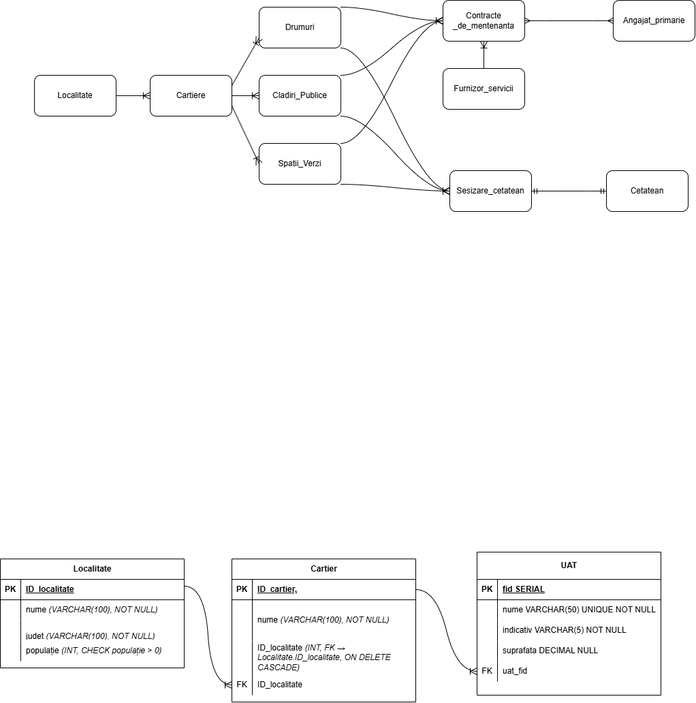

**Scenariul proiectului**

O primărie dorește să își digitalizeze evidența infrastructurii publice (drumuri, clădiri publice, spații verzi etc.), să gestioneze furnizorii de servicii de mentenanță și să monitorizeze sesizările cetățenilor cu privire la problemele infrastructurii.

Entitati:
•	Localitate
•	Cartier
•	Cladire_publica
•	Drum
• Spatiu_verde
• Furnizor_servici
• Contract_mentenanta
• Sesizare_cetatean
• Cetatean
•	Angajat_primarie

